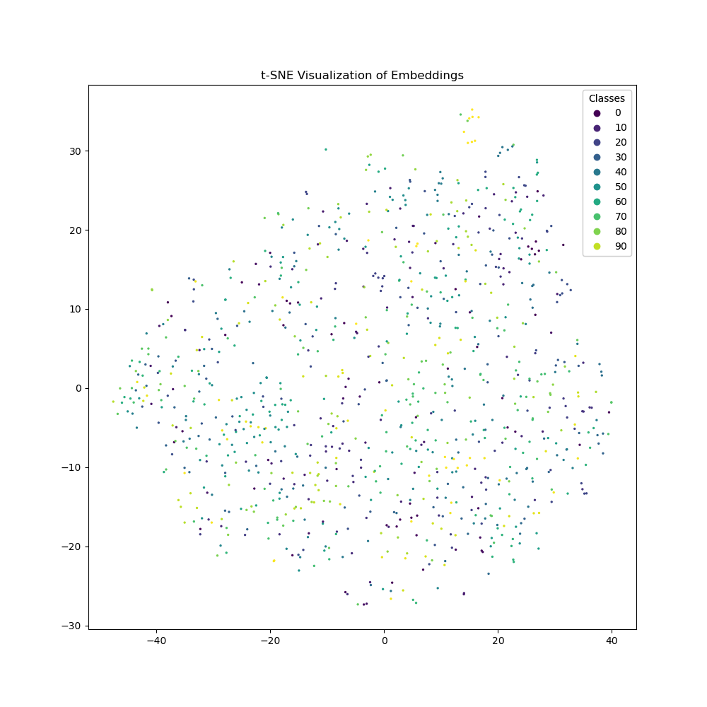
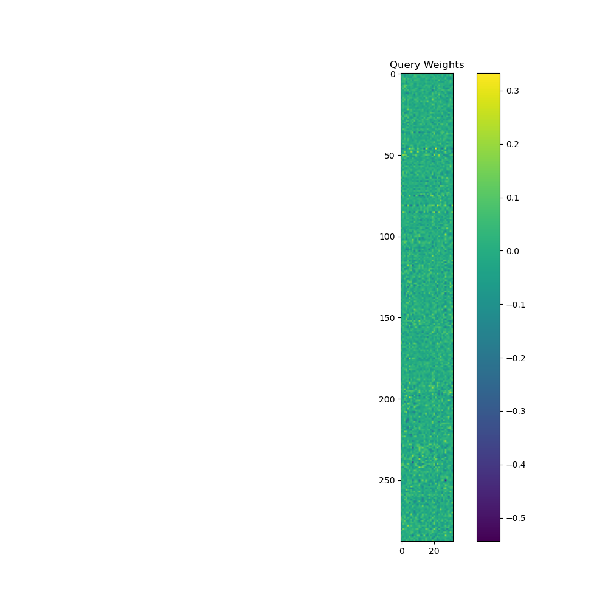
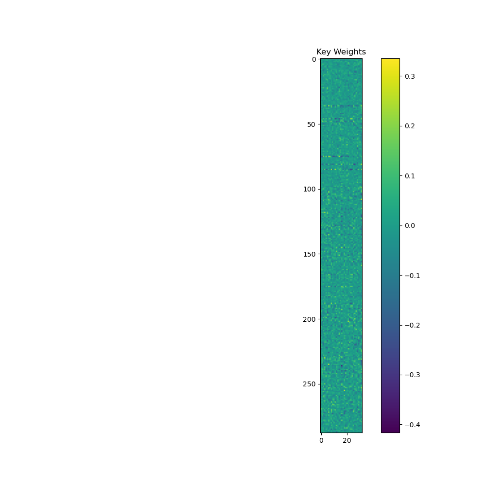
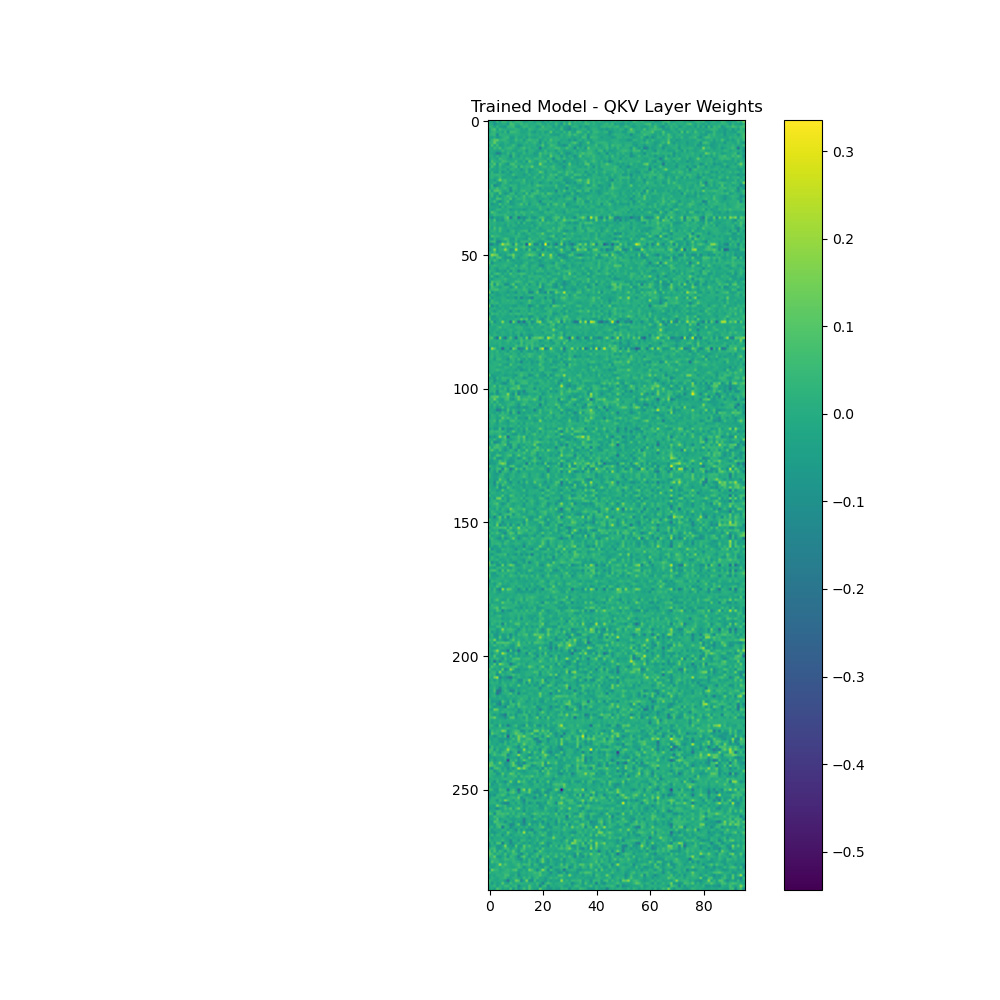

# Image Similarity Search with Swin Transformer

An image retrieval system using **Swin Transformer** feature embeddings and cosine similarity, with an interactive **Gradio** demo UI.

## Demo

The system accepts any input image and returns the top-5 most visually similar images from the dataset by comparing deep feature embeddings.



*t-SNE visualization of Swin Transformer embeddings — semantically similar images cluster together.*

## Background

Traditional image similarity relies on hand-crafted features (SIFT, HOG). This project uses a **pretrained Swin Transformer** (a hierarchical Vision Transformer with shifted windows) as a feature extractor, producing rich 768-dimensional embeddings that encode high-level semantic and structural information.

## Architecture

```
Input Image (any size)
      │
      ▼
┌─────────────────────────────────────┐
│     Preprocessing                   │
│  Resize → 224×224                   │
│  Normalize (μ=0.5, σ=0.5)          │
└────────────────┬────────────────────┘
                 │
                 ▼
┌─────────────────────────────────────┐
│   Swin Transformer (tiny)           │
│   swin_tiny_patch4_window7_224      │
│                                     │
│  Patch partition (4×4)              │
│  → Stage 1: W-MSA + SW-MSA ×2      │
│  → Stage 2: W-MSA + SW-MSA ×2      │
│  → Stage 3: W-MSA + SW-MSA ×6      │
│  → Stage 4: W-MSA + SW-MSA ×2      │
│  Classification head → Identity()   │
│  Output: 768-dim embedding          │
└────────────────┬────────────────────┘
                 │
                 ▼
┌─────────────────────────────────────┐
│   Cosine Similarity Search          │
│                                     │
│  sim(q, d) = (q · d) / (‖q‖ ‖d‖)  │
│  → Rank all dataset embeddings      │
│  → Return top-k indices             │
└────────────────┬────────────────────┘
                 │
                 ▼
         Top-5 Similar Images
```

## QKV Weight Analysis

Understanding attention mechanics:

| Weight Map | Description |
|---|---|
|  | Query attention weights |
|  | Key attention weights |
|  | Value attention weights |
|  | Combined QKV projection |

## Tech Stack

| Component | Technology |
|---|---|
| Language | Python 3 |
| Framework | PyTorch |
| Model | `timm` — `swin_tiny_patch4_window7_224` (pretrained ImageNet) |
| Similarity | scikit-learn `cosine_similarity` |
| Visualization | matplotlib (t-SNE), `sklearn.manifold.TSNE` |
| Demo UI | Gradio |
| Dataset | CIFAR-10 / CIFAR-100 |

## Key Implementation Details

### Feature Extraction
```python
model = timm.create_model('swin_tiny_patch4_window7_224', pretrained=True)
model.head = nn.Identity()  # Remove classification head → get 768-dim embeddings
```

### Similarity Search
```python
def find_similar_images(query_feature, dataset_features, top_k=5):
    similarities = cosine_similarity(query_feature, dataset_features)
    top_k_indices = similarities[0].argsort()[-top_k:][::-1]
    return top_k_indices.tolist(), similarities[0][top_k_indices].tolist()
```

### Gradio Interactive Demo
```python
with gr.Blocks() as iface:
    input_image = gr.Image(type="pil", label="Input Image")
    outputs = [gr.Image(type="pil", label=f"Similar Image {i+1}") for i in range(5)]
    input_image.change(fn=get_similar_images, inputs=input_image, outputs=outputs)
iface.launch(share=True)
```

## How to Run

```bash
pip install torch torchvision timm gradio scikit-learn matplotlib

# Basic similarity search
jupyter notebook Swin.ipynb

# Full Swin Transformer exploration
jupyter notebook Swin_Transformer.ipynb

# Complete implementation with attention analysis
jupyter notebook swinT.ipynb
```

## Repository Structure

```
Image_Similarity_SwinTransfomer/
├── README.md
├── CHANGELOG.md
├── Swin.ipynb                  ← Main similarity search notebook
├── Swin_Transformer.ipynb      ← Extended experiments
├── swinT.ipynb                 ← Full implementation + attention maps
├── tsne.png                    ← t-SNE embedding visualization
├── anchor.png                  ← Anchor image examples
├── qkv_weight.png              ← Combined QKV attention weights
├── q_weights.png               ← Query weights heatmap
├── k_weights.png               ← Key weights heatmap
├── v_weights.png               ← Value weights heatmap
├── oriqkv.png                  ← Original QKV visualization
├── trqkv.png                   ← Transformed QKV visualization
├── weight.png                  ← Attention weight map
├── ori1stcnn.png               ← First conv layer features
├── otr1stcnn.png               ← Transformed first layer features
├── saved_models/               ← Saved model checkpoints
├── cifar-100-python/           ← CIFAR-100 dataset
└── Image_Similarity_Final_Report.pdf
```

---

*Academic Project · Python · PyTorch · Vision Transformer · Image Retrieval · Gradio*
