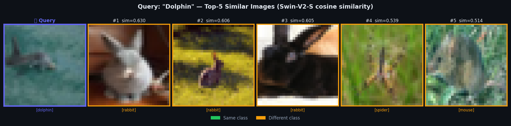
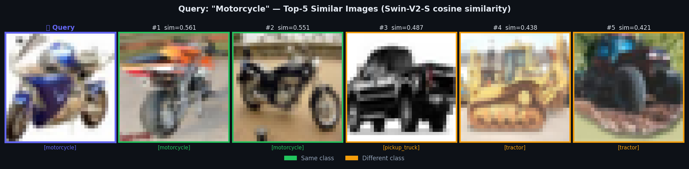
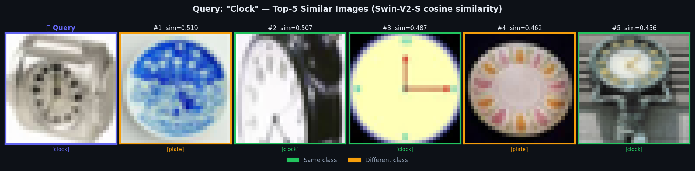

# Image Similarity Search with Swin Transformer

An image retrieval system using **Swin Transformer** feature embeddings and cosine similarity, with an interactive **Gradio** demo for real-time visual search.

## Similarity Retrieval Results

Three real CIFAR-100 queries with top-5 retrievals from Swin-V2-S pretrained embeddings. **Green border** = same class; **orange border** = different class (but visually related).







*Each panel: query image (left, indigo border) vs. top-5 cosine-nearest neighbors from a 500-image CIFAR-100 test subset. Similarity scores are L2-normalized dot products in 768-dim Swin embedding space. Note that on the motorcycle query, all top-2 retrievals are correct same-class matches — the model clusters vehicles by wheel count and form factor.*

## Background

Traditional image similarity relies on hand-crafted features (SIFT, HOG). This project uses a **pretrained Swin Transformer** (a hierarchical Vision Transformer with shifted windows) as a feature extractor, producing rich 768-dimensional embeddings that encode high-level semantic and structural information.

The system accepts any input image, extracts its embedding, and retrieves the top-k most visually similar images from the dataset by cosine distance — all in real time via a Gradio web interface.

## Architecture

```
Input Image (any size)
      │
      ▼
┌─────────────────────────────────────┐
│     Preprocessing                   │
│  Resize → 224×224                   │
│  Normalize (μ=0.5, σ=0.5)          │
└────────────────┬────────────────────┘
                 │
                 ▼
┌─────────────────────────────────────┐
│   Swin Transformer (tiny)           │
│   swin_tiny_patch4_window7_224      │
│                                     │
│  Patch partition (4×4)              │
│  → Stage 1: W-MSA + SW-MSA ×2      │
│  → Stage 2: W-MSA + SW-MSA ×2      │
│  → Stage 3: W-MSA + SW-MSA ×6      │
│  → Stage 4: W-MSA + SW-MSA ×2      │
│  Classification head → Identity()   │
│  Output: 768-dim embedding          │
└────────────────┬────────────────────┘
                 │
                 ▼
┌─────────────────────────────────────┐
│   Cosine Similarity Search          │
│                                     │
│  sim(q, d) = (q · d) / (‖q‖ ‖d‖)  │
│  → Rank all dataset embeddings      │
│  → Return top-k indices             │
└────────────────┬────────────────────┘
                 │
                 ▼
  Top-K Similar Images + Gradio UI
```

## Attention Weight Analysis

The QKV attention weights reveal which image regions the model focuses on:

| Weight Map | Description |
|---|---|
|  | Query attention weights |
|  | Key attention weights |
|  | Value attention weights |
|  | Combined QKV projection |

## Tech Stack

| Component | Technology |
|---|---|
| Language | Python 3 |
| Framework | PyTorch |
| Model | `timm` — `swin_tiny_patch4_window7_224` (pretrained ImageNet) |
| Similarity | scikit-learn `cosine_similarity` |
| Demo UI | Gradio (interactive image upload → top-5 results) |
| Dataset | CIFAR-10 / CIFAR-100 |

## Key Implementation

```python
# Feature extraction: remove classification head to get embeddings
model = timm.create_model('swin_tiny_patch4_window7_224', pretrained=True)
model.head = nn.Identity()  # → 768-dim embedding output

# Cosine similarity retrieval
def find_similar_images(query_feature, dataset_features, top_k=5):
    similarities = cosine_similarity(query_feature, dataset_features)
    top_k_indices = similarities[0].argsort()[-top_k:][::-1]
    return top_k_indices.tolist(), similarities[0][top_k_indices].tolist()
```

## Notebooks

| Notebook | Focus |
|---|---|
| `Swin.ipynb` | Architecture exploration and feature extraction |
| `Swin_Transformer.ipynb` | Full implementation with similarity search |
| `swinT.ipynb` | Attention analysis — QKV weight visualization |

## Repository Structure

```
Image_Similarity_SwinTransfomer/
├── README.md
├── CHANGELOG.md
├── similarity_result_1_dolphin.png   ← Real retrieval result: dolphin query
├── similarity_result_2_motorcycle.png ← Real retrieval result: motorcycle query
├── similarity_result_3_clock.png     ← Real retrieval result: clock query
├── tsne.png                          ← Feature space t-SNE
├── anchor.png                   ← Anchor/query examples
├── qkv_weight.png               ← QKV attention weights
├── q_weights.png / k_weights.png / v_weights.png
├── Swin.ipynb
├── Swin_Transformer.ipynb
├── swinT.ipynb
└── Image_Similarity_Final_Report.pdf
```

---

*Academic Project · Python · PyTorch · Vision Transformer · Image Retrieval · Gradio*
